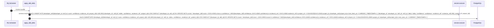

# Sequence: Worker apply_skill_delta

**Source:** [`skill_extractor.py`](../../Src/backend/worker/handlers/skill_extractor.py#L77)

```mermaid
sequenceDiagram
    autonumber
    participant Scheduler as RQ Scheduler
    participant Worker as apply_skill_delta
    participant Session as session.execute
    participant DB as PostgreSQL
    Scheduler->>Worker: Invoke handler
    Worker->>Session: session.execute(text('\n            INSERT INTO developer_skill(developer_id, skill_id, score, confidence, evidence_ref, project_id)\n            VALUES(:developer_id, :skill_id, :delta, :confidence, :evidence_ref, :project_id)\n            ON CONFLICT (developer_id, skill_id) DO UPDATE SET\n                score = developer_skill.score + EXCLUDED.score,\n                confidence = MAX(developer_skill.confidence, EXCLUDED.confidence),\n                evidence_ref = EXCLUDED.evidence_ref,\n                project_id = COALESCE(EXCLUDED.project_id, developer_skill.project_id),\n                last_seen_at = CURRENT_TIMESTAMP\n            '), {'developer_id': developer_id, 'skill_id': skill_id, 'delta': delta, 'confidence': confidence, 'evidence_ref': evidence_ref[:255], 'project_id': project_id})
    Worker->>DB: text('\n            INSERT INTO developer_skill(developer_id, skill_id, score, confidence, evidence_ref, project_id)\n            VALUES(:developer_id, :skill_id, :delta, :confidence, :evidence_ref, :project_id)\n            ON CONFLICT (developer_id, skill_id) DO UPDATE SET\n                score = developer_skill.score + EXCLUDED.score,\n                confidence = MAX(developer_skill.confidence, EXCLUDED.confidence),\n                evidence_ref = EXCLUDED.evidence_ref,\n                project_id = COALESCE(EXCLUDED.project_id, developer_skill.project_id),\n                last_seen_at = CURRENT_TIMESTAMP\n            ')
```
