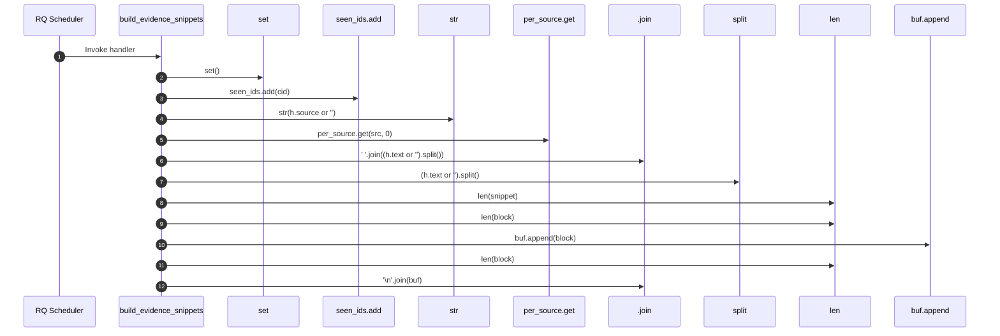

# Sequence: Worker build_evidence_snippets

**Source:** [`evidence_builder.py`](../../Src/backend/worker/handlers/evidence_builder.py#L6)

```mermaid
sequenceDiagram
    autonumber
    participant Scheduler as RQ Scheduler
    participant Worker as build_evidence_snippets
    participant Set as set
    participant Seen_ids as seen_ids.add
    participant Str as str
    participant Per_source as per_source.get
    participant Item as  .join
    participant Split as split
    participant Len as len
    participant Buf as buf.append
    Scheduler->>Worker: Invoke handler
    Worker->>Set: set()
    Worker->>Seen_ids: seen_ids.add(cid)
    Worker->>Str: str(h.source or '')
    Worker->>Per_source: per_source.get(src, 0)
    Worker->>Item: ' '.join((h.text or '').split())
    Worker->>Split: (h.text or '').split()
    Worker->>Len: len(snippet)
    Worker->>Len: len(block)
    Worker->>Buf: buf.append(block)
    Worker->>Len: len(block)
    Worker->>Item: '\n'.join(buf)
```
