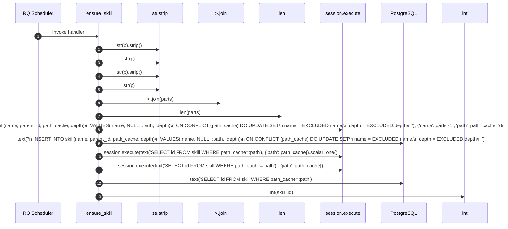

# Sequence: Worker ensure_skill

**Source:** [`skill_extractor.py`](../../Src/backend/worker/handlers/skill_extractor.py#L51)

```mermaid
sequenceDiagram
    autonumber
    participant Scheduler as RQ Scheduler
    participant Worker as ensure_skill
    participant Str as str.strip
    participant Item as >.join
    participant Len as len
    participant Session as session.execute
    participant DB as PostgreSQL
    participant Int as int
    Scheduler->>Worker: Invoke handler
    Worker->>Str: str(p).strip()
    Worker->>Str: str(p)
    Worker->>Str: str(p).strip()
    Worker->>Str: str(p)
    Worker->>Item: '>'.join(parts)
    Worker->>Len: len(parts)
    Worker->>Session: session.execute(text('\n            INSERT INTO skill(name, parent_id, path_cache, depth)\n            VALUES(:name, NULL, :path, :depth)\n            ON CONFLICT (path_cache) DO UPDATE SET\n                name = EXCLUDED.name,\n                depth = EXCLUDED.depth\n            '), {'name': parts[-1], 'path': path_cache, 'depth': depth})
    Worker->>DB: text('\n            INSERT INTO skill(name, parent_id, path_cache, depth)\n            VALUES(:name, NULL, :path, :depth)\n            ON CONFLICT (path_cache) DO UPDATE SET\n                name = EXCLUDED.name,\n                depth = EXCLUDED.depth\n            ')
    Worker->>Session: session.execute(text('SELECT id FROM skill WHERE path_cache=:path'), {'path': path_cache}).scalar_one()
    Worker->>Session: session.execute(text('SELECT id FROM skill WHERE path_cache=:path'), {'path': path_cache})
    Worker->>DB: text('SELECT id FROM skill WHERE path_cache=:path')
    Worker->>Int: int(skill_id)
```
