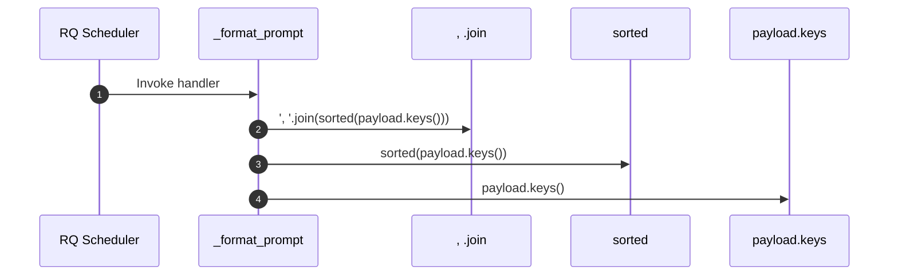

# Sequence: Worker _format_prompt

**Source:** [`skill_extractor.py`](../../Src/backend/worker/handlers/skill_extractor.py#L21)

```mermaid
sequenceDiagram
    autonumber
    participant Scheduler as RQ Scheduler
    participant Worker as _format_prompt
    participant Item as , .join
    participant Sorted as sorted
    participant Payload as payload.keys
    Scheduler->>Worker: Invoke handler
    Worker->>Item: ', '.join(sorted(payload.keys()))
    Worker->>Sorted: sorted(payload.keys())
    Worker->>Payload: payload.keys()
```
