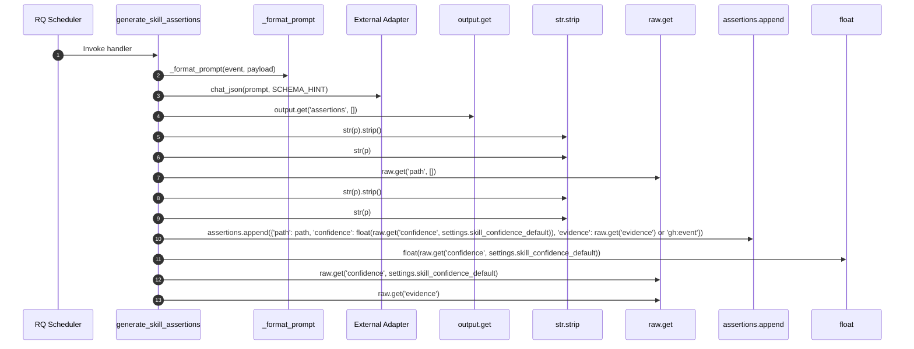

# Sequence: Worker generate_skill_assertions

**Source:** [`skill_extractor.py`](../../Src/backend/worker/handlers/skill_extractor.py#L30)

```mermaid
sequenceDiagram
    autonumber
    participant Scheduler as RQ Scheduler
    participant Worker as generate_skill_assertions
    participant Format_prompt as _format_prompt
    participant Adapter as External Adapter
    participant Output as output.get
    participant Str as str.strip
    participant Raw as raw.get
    participant Assertions as assertions.append
    participant Float as float
    Scheduler->>Worker: Invoke handler
    Worker->>Format_prompt: _format_prompt(event, payload)
    Worker->>Adapter: chat_json(prompt, SCHEMA_HINT)
    Worker->>Output: output.get('assertions', [])
    Worker->>Str: str(p).strip()
    Worker->>Str: str(p)
    Worker->>Raw: raw.get('path', [])
    Worker->>Str: str(p).strip()
    Worker->>Str: str(p)
    Worker->>Assertions: assertions.append({'path': path, 'confidence': float(raw.get('confidence', settings.skill_confidence_default)), 'evidence': raw.get('evidence') or 'gh:event'})
    Worker->>Float: float(raw.get('confidence', settings.skill_confidence_default))
    Worker->>Raw: raw.get('confidence', settings.skill_confidence_default)
    Worker->>Raw: raw.get('evidence')
```
