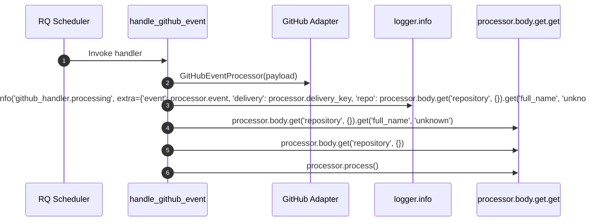

# Sequence: Worker handle_github_event

**Source:** [`github_handler.py`](../../Src/backend/worker/handlers/github_handler.py#L13)

```mermaid
sequenceDiagram
    autonumber
    participant Scheduler as RQ Scheduler
    participant Worker as handle_github_event
    participant GitHub as GitHub Adapter
    participant Logger as logger.info
    participant Processor as processor.body.get.get
    Scheduler->>Worker: Invoke handler
    Worker->>GitHub: GitHubEventProcessor(payload)
    Worker->>Logger: logger.info('github_handler.processing', extra={'event': processor.event, 'delivery': processor.delivery_key, 'repo': processor.body.get('repository', {}).get('full_name', 'unknown')})
    Worker->>Processor: processor.body.get('repository', {}).get('full_name', 'unknown')
    Worker->>Processor: processor.body.get('repository', {})
    Worker->>Processor: processor.process()
```
