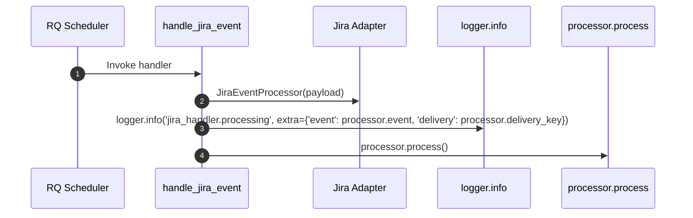

# Sequence: Worker handle_jira_event

**Source:** [`jira_handler.py`](../../Src/backend/worker/handlers/jira_handler.py#L11)

```mermaid
sequenceDiagram
    autonumber
    participant Scheduler as RQ Scheduler
    participant Worker as handle_jira_event
    participant Jira as Jira Adapter
    participant Logger as logger.info
    participant Processor as processor.process
    Scheduler->>Worker: Invoke handler
    Worker->>Jira: JiraEventProcessor(payload)
    Worker->>Logger: logger.info('jira_handler.processing', extra={'event': processor.event, 'delivery': processor.delivery_key})
    Worker->>Processor: processor.process()
```
