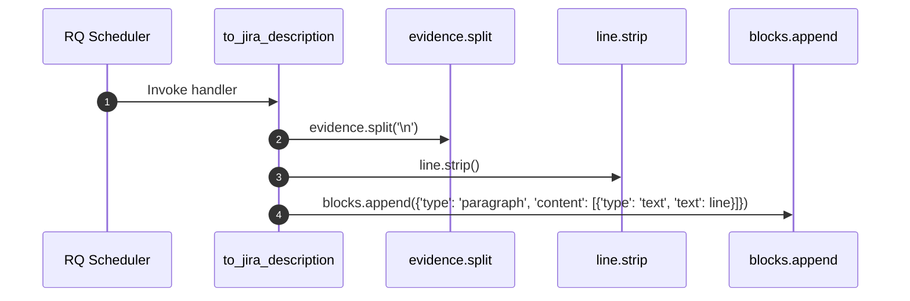

# Sequence: Worker to_jira_description

**Source:** [`evidence_builder.py`](../../Src/backend/worker/handlers/evidence_builder.py#L63)

```mermaid
sequenceDiagram
    autonumber
    participant Scheduler as RQ Scheduler
    participant Worker as to_jira_description
    participant Evidence as evidence.split
    participant Line as line.strip
    participant Blocks as blocks.append
    Scheduler->>Worker: Invoke handler
    Worker->>Evidence: evidence.split('\n')
    Worker->>Line: line.strip()
    Worker->>Blocks: blocks.append({'type': 'paragraph', 'content': [{'type': 'text', 'text': line}]})
```
