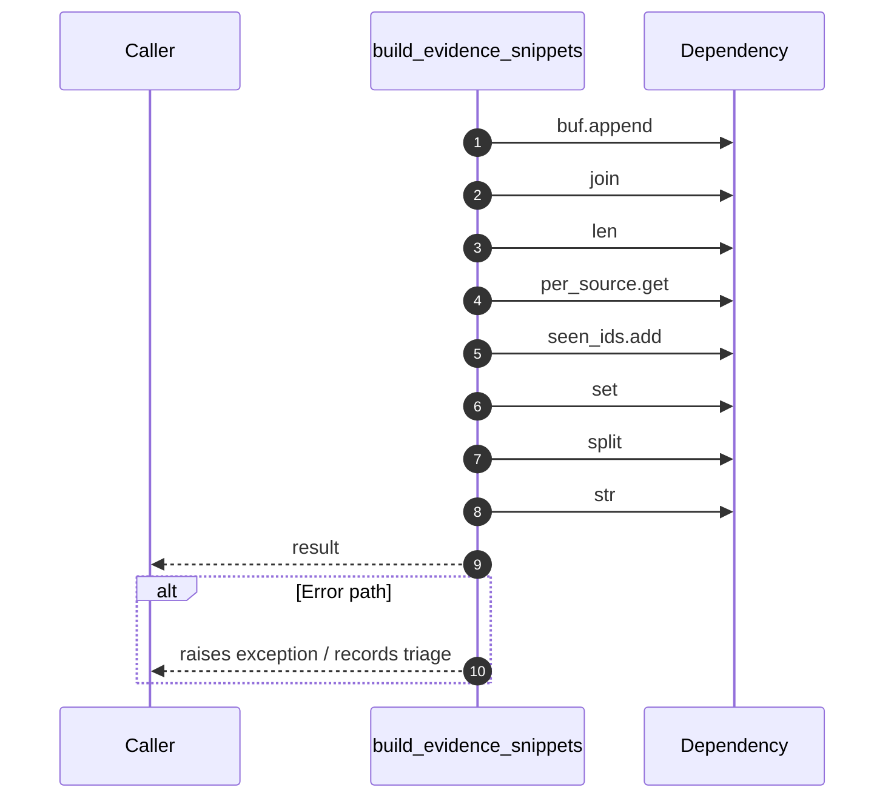

# Worker flow — `worker.handlers.evidence_builder.build_evidence_snippets`

- Module: `worker.handlers.evidence_builder`
- Source: [worker.handlers.evidence_builder.build_evidence_snippets](../Src/backend/worker/handlers/evidence_builder.py#L6)
- Summary: Build a compact, LLM-friendly evidence string:

