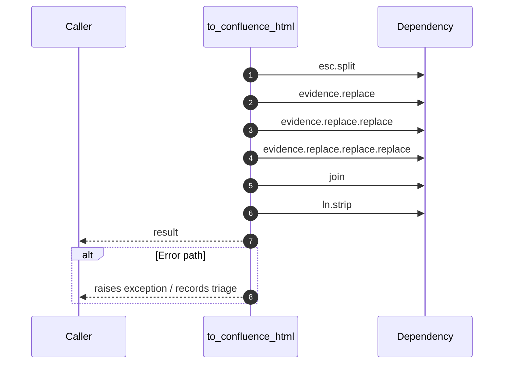

# Worker flow — `worker.handlers.evidence_builder.to_confluence_html`

- Module: `worker.handlers.evidence_builder`
- Source: [worker.handlers.evidence_builder.to_confluence_html](../Src/backend/worker/handlers/evidence_builder.py#L51)
- Summary: Convert raw evidence text into basic Confluence storage HTML.

