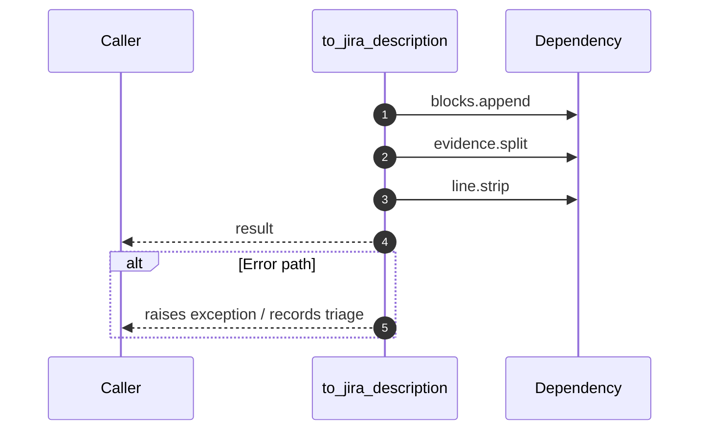

# Worker flow — `worker.handlers.evidence_builder.to_jira_description`

- Module: `worker.handlers.evidence_builder`
- Source: [worker.handlers.evidence_builder.to_jira_description](../Src/backend/worker/handlers/evidence_builder.py#L63)
- Summary: Convert evidence text into Jira's Atlassian Document Format.

