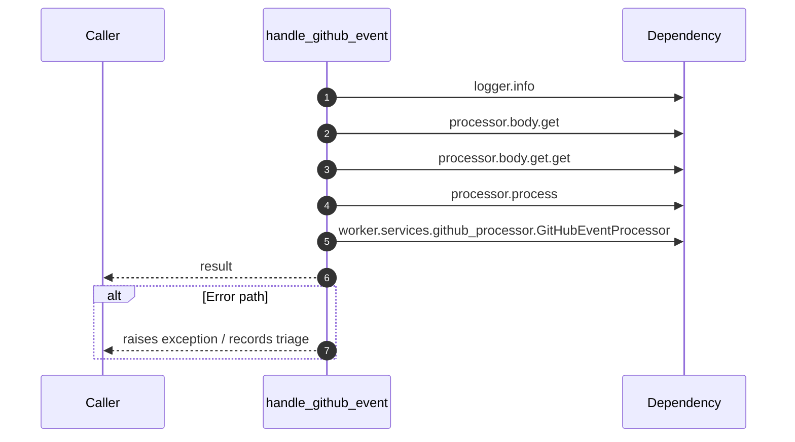

# Worker flow — `worker.handlers.github_handler.handle_github_event`

- Module: `worker.handlers.github_handler`
- Source: [worker.handlers.github_handler.handle_github_event](../Src/backend/worker/handlers/github_handler.py#L13)
- Summary: Dispatch a GitHub webhook payload to the GitHub processor.

