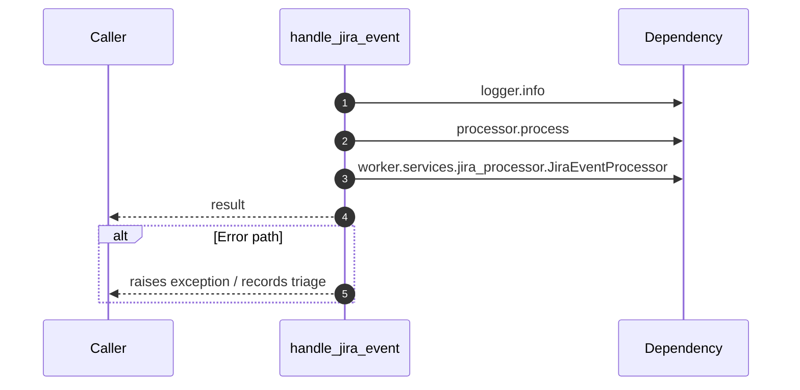

# Worker flow — `worker.handlers.jira_handler.handle_jira_event`

- Module: `worker.handlers.jira_handler`
- Source: [worker.handlers.jira_handler.handle_jira_event](../Src/backend/worker/handlers/jira_handler.py#L11)

