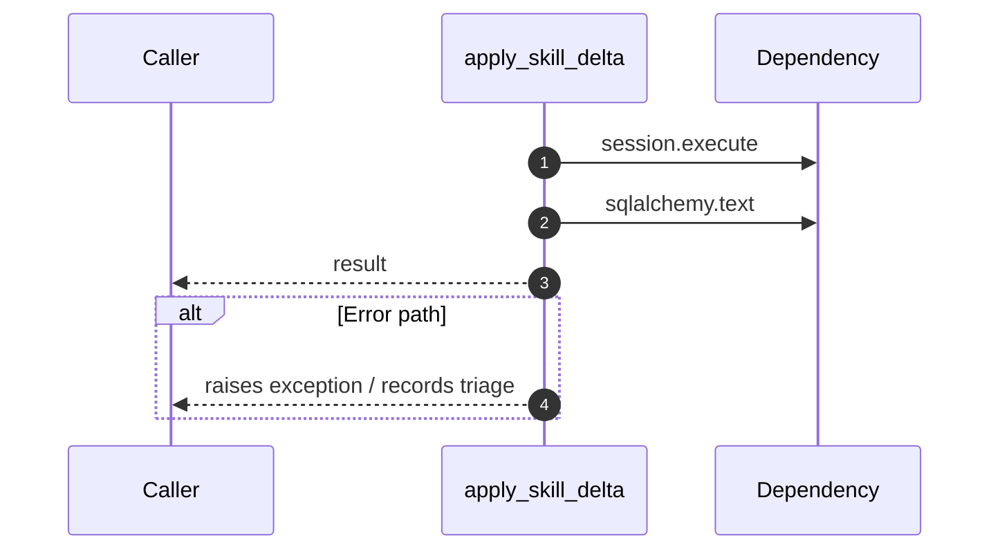

# Worker flow — `worker.handlers.skill_extractor.apply_skill_delta`

- Module: `worker.handlers.skill_extractor`
- Source: [worker.handlers.skill_extractor.apply_skill_delta](../Src/backend/worker/handlers/skill_extractor.py#L77)
- Summary: Apply a score delta to a developer skill, ensuring timestamps update.

