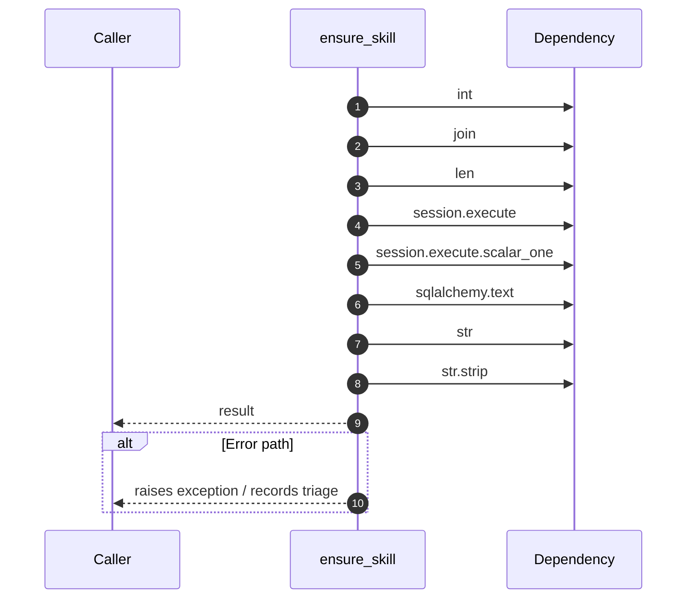

# Worker flow — `worker.handlers.skill_extractor.ensure_skill`

- Module: `worker.handlers.skill_extractor`
- Source: [worker.handlers.skill_extractor.ensure_skill](../Src/backend/worker/handlers/skill_extractor.py#L51)
- Summary: Ensure a skill hierarchy path exists and return the leaf skill id.

