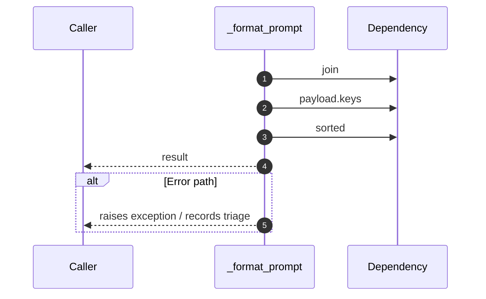

# Worker flow — `worker.handlers.skill_extractor._format_prompt`

- Module: `worker.handlers.skill_extractor`
- Source: [worker.handlers.skill_extractor._format_prompt](../Src/backend/worker/handlers/skill_extractor.py#L21)

