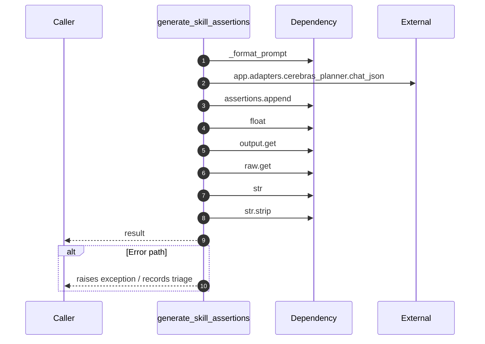

# Worker flow — `worker.handlers.skill_extractor.generate_skill_assertions`

- Module: `worker.handlers.skill_extractor`
- Source: [worker.handlers.skill_extractor.generate_skill_assertions](../Src/backend/worker/handlers/skill_extractor.py#L30)
- Summary: Call the planner to derive skill assertions without mutating the database.

